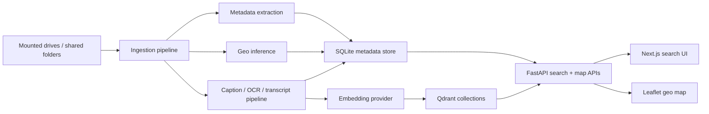
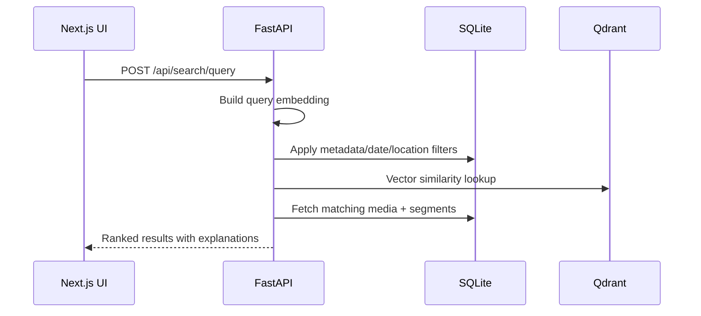

# Photo Hunting

Photo Hunting is a local-first multimodal photo and video discovery system built with FastAPI, Next.js, SQLite, and Qdrant. It combines semantic search, metadata filters, transcript/OCR indexing, and an interactive geographic media map inspired by Google Photos and Apple Photos.

## What is included

- FastAPI backend with ingestion, search, map, and media APIs
- SQLite metadata store with demo seed data for immediate local testing
- Qdrant vector indexing wrapper with graceful fallback to local cosine search
- Next.js frontend with natural-language search, result grid, media drawer, and Leaflet map
- Bounding-box map API, clustering, timeline filtering, and route overlays
- Docker Compose setup for `frontend`, `backend`, and `qdrant`

## Architecture overview



## Search flow



## Project structure

```text
PhotoHunting/
├── backend/
│   ├── app/
│   │   ├── api/
│   │   ├── core/
│   │   ├── data/
│   │   ├── db/
│   │   ├── models/
│   │   ├── schemas/
│   │   └── services/
│   ├── Dockerfile
│   └── pyproject.toml
├── frontend/
│   ├── app/
│   ├── components/
│   ├── lib/
│   ├── Dockerfile
│   ├── package.json
│   └── tsconfig.json
├── docker-compose.yml
└── .env.example
```

## Backend capabilities

- Recursive image/video scanning across configured media roots
- File hashing to avoid duplicate indexing and detect moved files
- EXIF extraction for images and `ffprobe`-based metadata extraction for videos when available
- GPS parsing plus folder/filename location inference
- Vector indexing into `image_items`, `video_items`, `video_keyframes`, and `text_chunks`
- Map points API with bounding box and metadata filters
- Route reconstruction grouped by trip for hike/travel playback

## Frontend capabilities

- Natural-language search with explanations panel
- Search facets for media type, country, city, and tags
- Interactive Leaflet map with client-side clustering and preview popups
- Timeline slider for narrowing results by year
- Route overlay toggle for trips such as hikes and travel days
- Result grid and detail drawer for captions, transcripts, OCR, and geo context

## Local setup

1. Copy the environment file:

   ```bash
   cp .env.example .env
   ```

2. Start the full stack:

   ```bash
   docker compose up --build
   ```

3. Open:
   - Frontend: [http://localhost:3000](http://localhost:3000)
   - Backend docs: [http://localhost:8000/docs](http://localhost:8000/docs)
   - Qdrant: [http://localhost:6333/dashboard](http://localhost:6333/dashboard)

## Development without Docker

Backend:

```bash
cd backend
python3 -m venv .venv
source .venv/bin/activate
pip install -e .
uvicorn app.main:app --reload
```

Frontend:

```bash
cd frontend
npm install
npm run dev
```

## Example API calls

```bash
curl "http://localhost:8000/api/map/points?media_type=image&country=Scotland"
```

```bash
curl -X POST "http://localhost:8000/api/search/query" \
  -H "Content-Type: application/json" \
  -d '{"query":"Show hiking photos in Scotland","limit":12}'
```

## Example queries

- Show hiking photos in Scotland
- Find sunset photos near the sea
- Show the videos where we were sailing
- Find pictures of my black cat
- Show photos taken near Glencoe
- Find videos recorded in Japan

## Notes on Gemini

The scaffold includes a configurable Gemini embedding provider interface, but defaults to a deterministic local embedding mode so the project remains runnable even before API credentials are added. Switch `EMBEDDING_PROVIDER=gemini` after setting `GEMINI_API_KEY` and confirming the current Google embedding model configured for your account.

