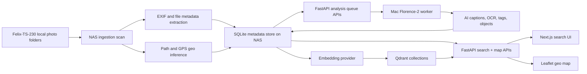
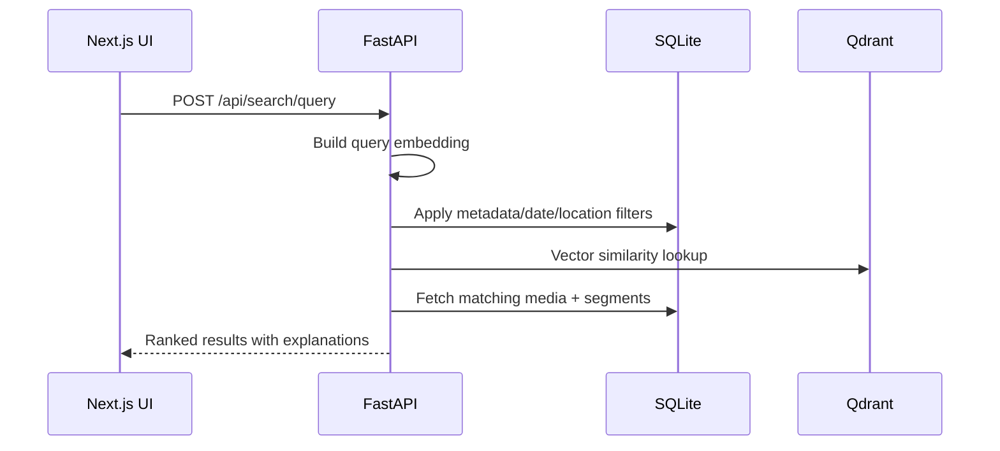

# Photo Hunting

Photo Hunting is a local-first multimodal photo and video discovery system built with FastAPI, Next.js, SQLite, and Qdrant. It combines semantic search, metadata filters, transcript/OCR indexing, and an interactive geographic media map inspired by Google Photos and Apple Photos.

The current production-oriented setup is a split architecture tuned for low-power NAS hardware:

- `Felix-TS-230` scans local media, extracts EXIF/core metadata, and serves the app
- your Mac runs the open-source Florence-2 image worker
- the Mac worker writes rich image metadata back into the NAS-hosted PhotoHunting database through the API

## What is included

- FastAPI backend with ingestion, search, map, media, and image-analysis queue APIs
- SQLite metadata store with demo seed data for immediate local testing
- Qdrant vector indexing wrapper with graceful fallback to local cosine search
- Next.js frontend with natural-language search, result grid, media drawer, and Leaflet map
- Bounding-box map API, clustering, timeline filtering, and route overlays
- Florence-2 worker script for captioning, OCR, object extraction, and AI tag generation on your Mac
- Docker Compose setup for `frontend`, `backend`, and `qdrant`

## Architecture overview



## Search flow



## Project structure

```text
PhotoHunting/
├── backend/
│   ├── app/
│   │   ├── api/
│   │   ├── core/
│   │   ├── data/
│   │   ├── db/
│   │   ├── models/
│   │   ├── schemas/
│   │   └── services/
│   ├── Dockerfile
│   └── pyproject.toml
├── frontend/
│   ├── app/
│   ├── components/
│   ├── lib/
│   ├── Dockerfile
│   ├── package.json
│   └── tsconfig.json
├── docker-compose.yml
└── .env.example
```

## Backend capabilities

- Recursive image/video scanning across configured media roots
- File hashing to avoid duplicate indexing and detect moved files
- EXIF extraction for images and `ffprobe`-based metadata extraction for videos when available
- GPS parsing plus folder/filename location inference
- Image analysis job queue with `pending`, `claimed`, `completed`, and `failed` states
- Vector indexing into `image_items`, `video_items`, `video_keyframes`, and `text_chunks`
- Map points API with bounding box and metadata filters
- Route reconstruction grouped by trip for hike/travel playback

## Frontend capabilities

- Natural-language search with explanations panel
- Search facets for media type, country, city, and tags
- Interactive Leaflet map with client-side clustering and preview popups
- Timeline slider for narrowing results by year
- Route overlay toggle for trips such as hikes and travel days
- Result grid and detail drawer for captions, transcripts, OCR, geo context, and AI metadata status

## Local setup

1. Copy the environment file:

   ```bash
   cp .env.example .env
   ```

2. Start the full stack:

   ```bash
   docker compose up --build
   ```

3. Open:
   - Frontend: [http://localhost:3000](http://localhost:3000)
   - Backend docs: [http://localhost:8000/docs](http://localhost:8000/docs)
   - Qdrant: [http://localhost:6333/dashboard](http://localhost:6333/dashboard)

## Development without Docker

Backend:

```bash
cd backend
python3 -m venv .venv
source .venv/bin/activate
pip install -e .
uvicorn app.main:app --reload
```

Frontend:

```bash
cd frontend
npm install
npm run dev
```

## Split deployment for Felix-TS-230

1. Run the FastAPI app on the NAS and point `MEDIA_ROOTS` at the NAS-local library path, for example:

   ```bash
   MEDIA_ROOTS=["/share/Public/Photo"]
   ```

2. Start an image-only scan on the NAS. The scanner now does metadata extraction only and marks images for background AI analysis instead of calling a hosted model inline.

3. On your Mac, create a worker environment and install Florence dependencies:

   ```bash
   python3 -m venv .venv-florence
   source .venv-florence/bin/activate
   pip install -r scripts/requirements-florence.txt
   ```

   If you already created the Florence venv with a newer `transformers` release, refresh it with:

   ```bash
   pip install --upgrade --force-reinstall -r scripts/requirements-florence.txt
   ```

4. Run the Florence worker against the NAS-hosted API:

   ```bash
   python scripts/florence_worker.py \
     --api-base-url http://felix-ts-230:8000/api \
     --device auto
   ```

The worker claims pending image jobs from the NAS, downloads each image via `/api/media/{id}/stream`, runs Florence-2 locally on your Mac, and posts normalized AI metadata back through `/api/analysis/results/{id}`.

## Analysis queue APIs

```bash
curl "http://localhost:8000/api/analysis/jobs?status=pending&limit=5"
```

```bash
curl "http://localhost:8000/api/analysis/stats"
```

Core endpoints:

- `GET /api/analysis/jobs`
- `POST /api/analysis/jobs/{media_id}/claim`
- `POST /api/analysis/results/{media_id}`
- `POST /api/analysis/heartbeat/{worker_id}`
- `GET /api/analysis/stats`

## Example API calls

```bash
curl "http://localhost:8000/api/map/points?media_type=image&country=Scotland"
```

```bash
curl -X POST "http://localhost:8000/api/search/query" \
  -H "Content-Type: application/json" \
  -d '{"query":"Show hiking photos in Scotland","limit":12}'
```

## Example queries

- Show hiking photos in Scotland
- Find sunset photos near the sea
- Show the videos where we were sailing
- Find pictures of my black cat
- Show photos taken near Glencoe
- Find videos recorded in Japan

## Notes on embeddings and AI metadata

- The live NAS-friendly design keeps the scanner metadata-only and uses Florence-2 on your Mac for rich image metadata.
- Gemini embedding support remains available for search if you explicitly enable it, but it is no longer required for image metadata extraction.
- The default backend embedding mode is still deterministic so the stack remains runnable without external API keys.
